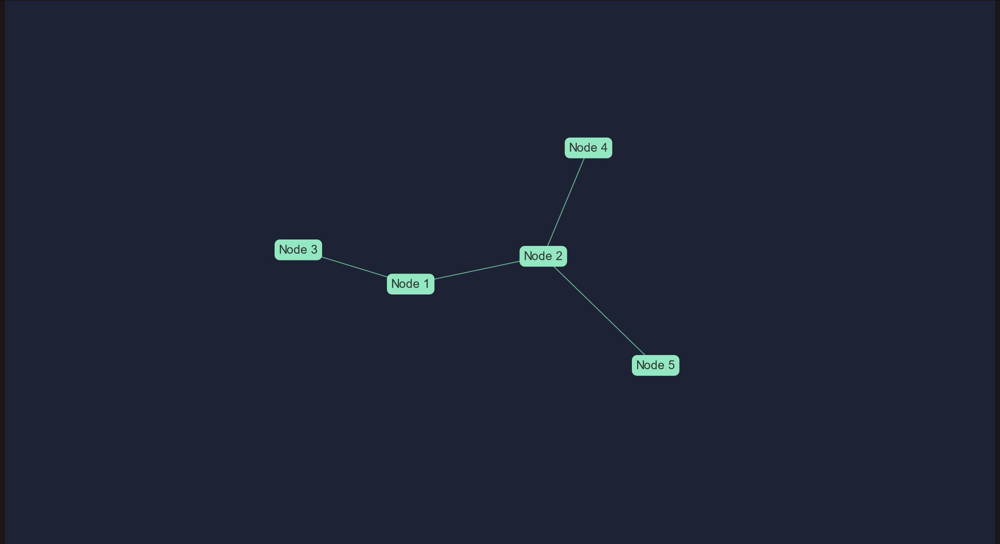

## Разработка генератора псевдо-случайных чисел на <g>Flask</g>
<gr>Подготовили:</gr> 
Тришин Андрей
Владимир Бредихин
Дмитрий Шепелев

---
# CoolPRND

---
# WebPRND

---
### Основные используемые технологии:

- <gr>SQLAlchemy</gr>
- TypeScript
- <gr>Bootstrap</gr>
- Flask
- <gr>vis.js</gr>

---
### Ещё немного об используемых <g>технологиях</g>

---
### Изначальный стэк технологий

---
### Интересный факт
При разработке первой рабочей версии редактора
страница не имела файла .css и была сделана чисто
на <g>Bootstrap</g>

---
# О недостатках <g>Flask-Login</g>

---
### Строение <gr>токена авторизации</gr>

---
# Спасибо за внимание <g>:></g>